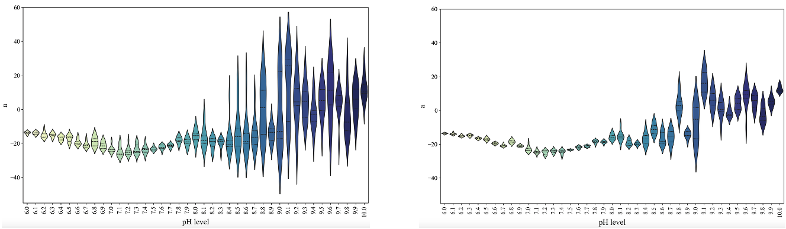

# Data Smoothing using Kalman Filter

This code removes outliers and smooths the data by applying the Kalman filter, a recursive algorithm commonly used in signal processing and time-series analysis to estimate the true state of a system by iteratively refining predictions based on prior knowledge and new observations. In this implementation, the Kalman filter was imported from the Python library 'Pykalman'. 

Below is a sample dataset after being smoothed using the Kalman filter.

Part of the thesis entitled: "Development of a Non-invasive Vision-based Halochromic Sensor System for Chronic Wound Monitoring"
